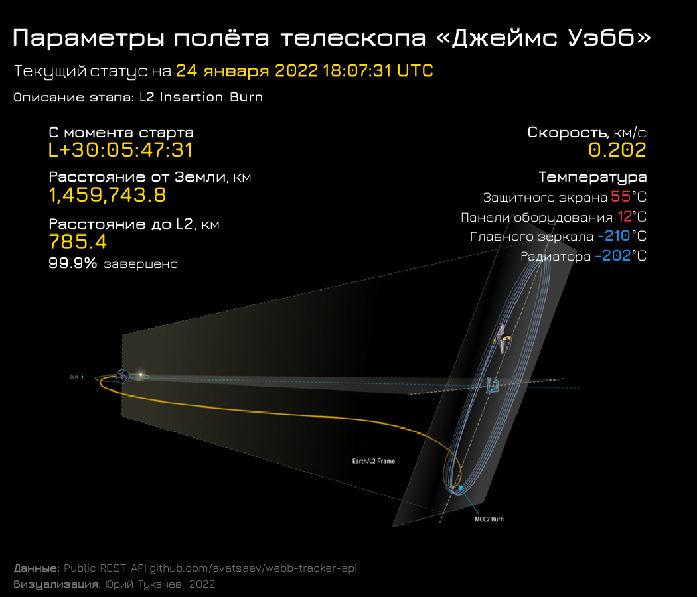

# JWST

**Параметры полёта телескопа JWST (James Webb Space Telescope)**

Скачиваем данные с параметрами телескопа через API <https://github.com/avatsaev/webb-tracker-api> и делаем мини-дашборд с помощью ggplot2

**Статичная картинка**

Изображение JWST отражает текущее состояние телескопа

**Обновляемый вариант**

<https://psych.shinyapps.io/jwst_status/>

**Официальный сайт с параметрами телескопа**

<https://jwst.nasa.gov/content/webbLaunch/whereIsWebb.html?units=metric>
